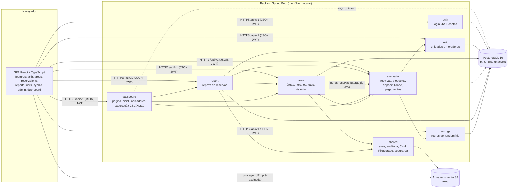
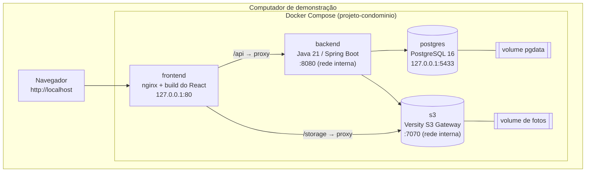

# Turno

**Turno** é um sistema web de reserva de áreas comuns (churrasqueira, salão de festas, quadra,
piscina...) para condomínios residenciais de pequeno e médio porte. Título acadêmico: *Sistema
Integrado de Gestão e Reserva de Áreas de Lazer para Condomínios Residenciais*, disciplina
**CIC1060 – Arquitetura e Desenho de Software**.

A proposta trata a disputa por espaços concorridos como um problema de alocação justa: as regras
de reserva são parâmetros do condomínio (não valores fixos no código), o morador vê o motivo de
cada recusa antes de enviar o pedido, o histórico de uso e de conservação de cada espaço fica
registrado, e duas reservas nunca ocupam o mesmo horário, mesmo sob acesso simultâneo, porque o
banco de dados garante isso.

> Uso previsto: demonstração conduzida pela equipe, com dados fictícios. Não há usuários reais nem
> publicação online.

## O que o sistema faz

| Perfil | Principais funções |
|---|---|
| **Morador** (`UNIT`, uma conta por unidade) | Catálogo com regras e fotos; reserva em até 4 passos com a regra explicada quando o horário não pode ser reservado; "Minhas reservas" com status e motivo; cancelamento no prazo; report de problema da reserva, com fotos. |
| **Síndico** (`SYNDIC`) | Página inicial (hoje, próximos 7 dias, reports abertos, vistorias atrasadas); agenda completa com contato por WhatsApp; bloqueios de agenda; caixa de reports; vistorias e comparador de fotos; dashboard em modo leitura e exportação. |
| **Administração** (`ADMIN`) | Tudo do síndico, mais: unidades e moradores, áreas e status (manutenção cancela as reservas afetadas com justificativa), confirmação manual de pagamentos, parâmetros de regra do condomínio, contas de síndico. |

Pagamentos não são processados pelo sistema: área paga gera reserva "Pendente", o
morador é levado ao WhatsApp da administração e a administração confirma manualmente.

## Arquitetura

**Monólito modular em camadas, organizado por funcionalidade.** Um único backend Spring Boot,
dividido em módulos de negócio; cada módulo tem as camadas `api` (controllers e DTOs) →
`application` (casos de uso, transações, autorização por recurso) → `domain` (entidades e regras)
→ `infra` (repositórios e integrações). Um módulo só conversa com outro pelo serviço público dele.
A única exceção é o `dashboard`, um modelo de leitura com consultas SQL agregadas que nunca
escreve.

### Diagrama de componentes



### Diagrama de implantação (Docker Compose local)



Todas as portas publicadas no host ficam em `127.0.0.1`. O backend e o armazenamento de fotos não
têm porta no host: só o nginx fala com eles.

### Decisões que valem citar

- **Sem sobreposição garantida pelo banco:** as reservas ficam numa tabela com *exclusion
  constraint* (`EXCLUDE USING gist (area_id WITH =, tstzrange(start_at, end_at) WITH &&)`) para
  reservas ativas. Bloqueios da administração são linhas da mesma tabela, então a mesma regra os
  cobre. A violação vira `409 RESERVATION_OVERLAP`. Um lock consultivo por área antes da escrita
  evita que muitas tentativas simultâneas terminem em deadlock.
- **Regras configuráveis:** antecedência mínima, janela de reserva para o dia seguinte, limite de
  reservas ativas por unidade, prazo de cancelamento e janela de report são parâmetros do
  condomínio, editáveis pela administração.
- **Tempo testável:** datas em UTC no banco, regras no fuso do condomínio (`America/Sao_Paulo`) e
  `java.time.Clock` injetado em todo lugar. O perfil `demo` usa um relógio simulado para que o
  roteiro funcione em qualquer horário.
- **Segurança e LGPD:** JWT de acesso de 15 min em memória e refresh token em cookie `httpOnly`;
  autorização por recurso (uma unidade só vê os próprios dados); CPF visível só para a
  administração; exportações sem CPF, telefone ou e-mail; auditoria de toda ação de síndico e
  administração sobre reservas, áreas, unidades e reports.
- **Fotos fora do container:** gravadas num serviço S3 e servidas por URL pré-assinada de 5
  minutos, gerada só depois da checagem de acesso.

## Stack

- **Backend:** Java 21, Spring Boot 3.5, Spring Security, Data JPA, Flyway, springdoc-openapi,
  Apache POI (XLSX).
- **Banco:** PostgreSQL 16 com `btree_gist` e `unaccent`.
- **Frontend:** React 19 + TypeScript + Vite, React Router, TanStack Query, React Hook Form + Zod,
  Tailwind CSS, Recharts.
- **Testes:** JUnit 5, Mockito, Testcontainers (PostgreSQL real), MockMvc; Vitest + Testing
  Library; k6 para concorrência e carga.
- **Infra local:** Docker Compose com `postgres`, `s3`, `backend` e `frontend` (nginx).

## Estrutura do repositório

```
/
├── docker-compose.yml
├── backend/     API REST (Spring Boot): módulos auth, unit, area, reservation, report,
│                settings, dashboard, shared; migrations Flyway; testes
├── frontend/    Interface web (React + TypeScript), organizada por funcionalidade
├── scripts/     verificação do backend em container e ambiente de demonstração
├── k6/          scripts de concorrência e carga
└── e2e/         ensaio do roteiro em navegador (Playwright)
```

## Como rodar

Pré-requisito: Docker (Desktop no Windows/macOS, Engine + Compose no Linux). Não precisa de Java
nem de Node instalados.

```bash
docker compose up --build -d       # sobe tudo em http://localhost
docker compose ps                  # os 4 serviços devem ficar "healthy"
docker compose down                # para (acrescente -v para apagar banco e fotos)
```

- Interface: `http://localhost`
- Documentação da API (Swagger): `http://localhost/api/swagger-ui.html`
- Health check: `/actuator/health` na porta interna do backend, usado pelo healthcheck do
  container (não passa pelo nginx).

### Testes

```bash
bash scripts/backend-verify.sh     # mvn verify num container + Testcontainers (sem Java no PC)
cd frontend && npm ci && npm test && npm run lint && npm run build
```

No PowerShell: `.\scripts\backend-verify.ps1`.

### Concorrência e carga (k6)

Os scripts ficam em `k6/` e rodam pela imagem pública `grafana/k6`, sem instalar nada (veja
`k6/README.md`). Resultado no ambiente Docker local, perfil `demo`:

- **50 pedidos simultâneos para o mesmo horário da mesma área:** 1 reserva criada, 49 respostas
  `409 RESERVATION_OVERLAP`, nenhum erro 5xx.
- **100 usuários simultâneos em endpoints de leitura (~1 min):** p95 geral de 406 ms, todos os
  endpoints medidos abaixo de 500 ms (o pior foi o detalhe de área, 458 ms). A primeira rodada
  mostrou o catálogo de áreas em 958 ms por consultas repetidas por área e por foto; a correção
  passou a buscar capas e autores em lote.

### Ensaio do roteiro em navegador (Playwright)

A pasta `e2e/` percorre o roteiro da apresentação em viewport de celular (360 px) e desktop, com
a imagem pública do Playwright rodando na rede do Docker Compose (nada é instalado no PC). Veja
`e2e/README.md`.

### Ambiente de demonstração

O perfil `demo` sobe com dados fictícios prontos (unidades, áreas, cerca de seis meses de
histórico de reservas, reservas em todos os estados, reports, vistorias) e um relógio simulado:

```bash
bash scripts/demo-reset.sh --now 2026-11-10T10:00   # apaga os dados do projeto e recria o cenário
bash scripts/demo-up.sh                             # sobe sem apagar

# Windows (PowerShell)
.\scripts\demo-reset.ps1 -Now 2026-11-10T10:00
.\scripts\demo-up.ps1
```

Na primeira execução, o script gera um `.env` local com segredos aleatórios e imprime as senhas das
contas fictícias de demonstração: `admin@exemplo.test`, `sindico@exemplo.test` e as unidades
`a-101`, `a-102` (com senha temporária), `b-201`, `b-202`, `a-103` e `b-203`.

## Contas de exemplo (perfil padrão `local`)

Com `docker compose up --build` (sem trocar `SPRING_PROFILES_ACTIVE`), o sistema sobe no perfil
`local`, com um condomínio fictício e uma conta de cada perfil:

| Perfil | Login | Senha |
|---|---|---|
| **Administração** (`ADMIN`) | `admin@exemplo.test` | `troque-esta-senha` |
| **Síndico** (`SYNDIC`) | `sindico@exemplo.test` | `LocalDev123!` |
| **Morador, unidade A-101** (`UNIT`) | `a-101` | `LocalDev123!` |
| **Morador, unidade B-201** (`UNIT`) | `b-201` | `LocalDev123!` |

São credenciais de desenvolvimento, válidas só no ambiente local com dados fictícios, e podem ser
trocadas por variáveis de ambiente (veja `.env.example`).
